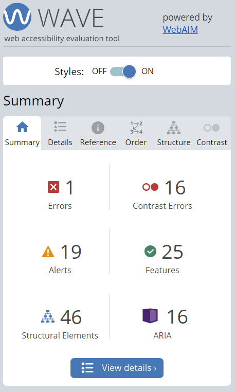

# Social media dashboard

This is a solution to the [Social media dashboard with a theme switcher challenge on Frontend Mentor](https://www.frontendmentor.io/challenges/social-media-dashboard-with-theme-switcher-6oY8ozp_H). Frontend Mentor challenges help you improve your coding skills by building realistic projects.  


## Technologies

The technologies used in this design are:

* HTML & SCSS & Ts
* Angular
* Theme Switcher (light-dark mode)

## Setup

To run this app in development mode open the terminal and write the following:

```sh  
git clone https://github.com/Zakaria9375/fm-social-dashboard.git 
cd fm-time-tracking  
npm install 
 
// you need to install angular cli to run this app in development mode
npm install -g @angular/cli

ng serve
```

## Links

* [Challenge](https://www.frontendmentor.io/challenges/social-media-dashboard-with-theme-switcher-6oY8ozp_H)  
* [Live](https://za-social-dashboard.netlify.app/)

## Testing for Accessibility

Scopes of Accessibility testing for this app:  

* Zooming: No loss of content or functionality.
* Zooming (text-only): No loss of content till 150%.
* Keyboard-only: Interactive elements are accessible(focusable) and clickable.
* Static code analysis: passed except for the following: Heading nesting  
* Screen Reader: 



## Retrospectives  

### What went well?

* Light-Dark Theme Implementation.
* Proper styling for angular application using SCSS.
* Perfect pixel design.
* Accessible App

### What could be improved?

* Pre-defining the main heading styles while converting Figma to code could be improved by utilizing classes instead of HTML tags.
* Automated testing for accessibility.

### What we have learned?  

* The choice of heading tags (`<h1>`, `<h2>`, `<h3>`, etc.) in HTML should be based on the structure and hierarchy of the content, not on the visual size of the text. Heading tags are primarily used to indicate the structure and importance of content on a page, which is crucial for accessibility, SEO, and overall document organization.  
